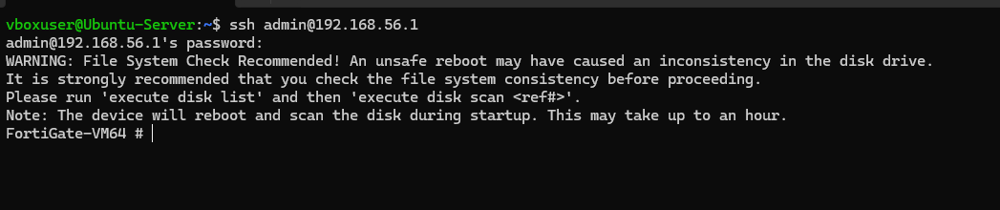
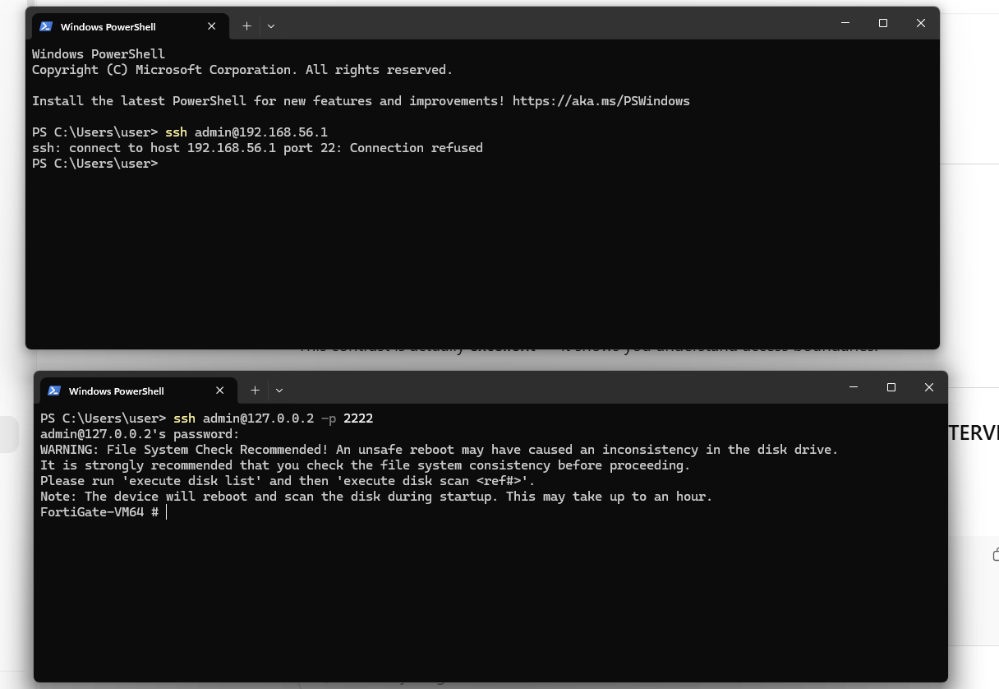

# Phase 3 – Management Access (SSH)

## Objective
Establish secure administrative access to FortiGate using SSH while enforcing proper network segmentation and access control.

---

## Access Scenarios Tested

### 1. SSH from Internal LAN Host (Ubuntu Server)
- Source: Ubuntu Server (192.168.56.10)
- Destination: FortiGate LAN IP (192.168.56.1)
- Result: ✅ Successful

This confirms:
- SSH is enabled on the LAN interface
- FortiGate administrative access is reachable from trusted internal networks
- Local-in access policy is functioning as intended

---

### 2. SSH from Windows Host (Direct)
- Source: Windows Host (192.168.0.0/24)
- Destination: FortiGate LAN IP (192.168.56.1)
- Result: ❌ Connection refused

Reason:
- Windows host is not part of the FortiGate LAN subnet
- FortiGate does not expose SSH on WAN-facing interfaces
- This behavior follows security best practices

---

### 3. SSH from Windows Host (Port Forwarding)
- Method: VirtualBox NAT port forwarding
- Command: `ssh admin@127.0.0.2 -p 2222`
- Result: ✅ Successful

This demonstrates:
- Controlled external access using port forwarding
- No direct exposure of FortiGate management plane to WAN
- Secure administrative access without weakening firewall posture

---

## Security Design Rationale
- Management access restricted to LAN by default
- No direct WAN SSH access
- Bastion-style access via internal host or controlled port forwarding
- Aligns with enterprise firewall hardening practices

---

## Outcome
Secure, segmented, and auditable FortiGate management access successfully implemented.
